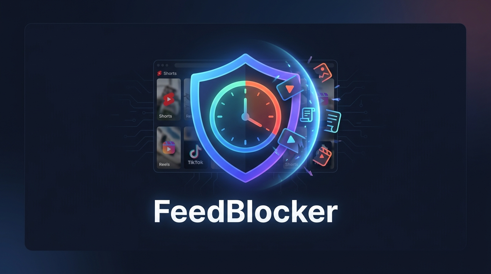
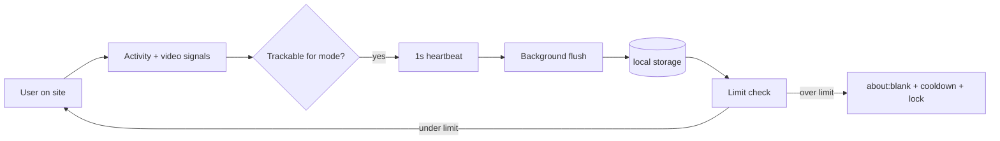

<div align="center">
  

  # FeedBlocker 🛡️

  **Hard limits for distracting sites.**  
  Track real active time, set daily and session caps, and get sent to a blank page when time is up. No snooze, no “just five more minutes.”

  [](https://chrome.google.com/webstore)
  [](LICENSE)
  [](https://github.com/TahaUsmanK/Insights)
</div>

<br />

---

## 🎯 Why FeedBlocker?

Most screen-time tools nudge you with soft reminders. FeedBlocker is built for people who need **strict enforcement**:

- ⏱️ **Counts Active Time**: Tracks real interaction (idle-aware, video-aware), not just "tab open".
- 📊 **Budgets & Bursts**: Set daily limits and session burst caps per site.
- 🌙 **Scheduled Limits**: Enforce stricter caps on evenings and weekends.
- ⏳ **Mandatory Cooldowns**: Forces a cooldown after a block so you cannot instantly reload.
- 🔒 **Limit Lock**: Prevents you from raising a cap while that limit period is active.
- 🛑 **No Bypass**: Redirects you to `about:blank` when time is up. There is no snooze button.

---

## 🌐 Supported Sites

Configure tracking modes per site in the options page to suit your specific focus needs.

| Site | Tracking Modes |
| :--- | :--- |
| **YouTube** | Entire site · Shorts only · Video playing only |
| **Instagram** | Entire site · Reels only · Video playing only |
| **X (Twitter)** | Entire site · Video playing only |
| **TikTok** | Entire site · Video playing only |
| **Facebook** | Entire site · Reels only · Video playing only |
| **Reddit** | Entire site · Video playing only |
| **LinkedIn** | Entire site · Video playing only |
| **Twitch** | Entire site · Video playing only *(default)* |
| **Pinterest** | Entire site · Video playing only |

---

## ✨ Features

### ⏱️ Time Tracking
- **Active time**: Tracks mouse, keyboard, scroll, touch, and visibility; features a 30s idle threshold.
- **Session time**: Measures continuous active time in one visit; resets after 5 minutes of idle time.
- **Video detection**: Counts playback when a video is substantially visible (≥20% in viewport).
- **SPA-aware**: Detects route changes on single-page apps (History API + polling).
- **Unified engine**: One robust tracker pipeline for all sites via a platform registry.

### 🚧 Limits
- **Daily limits**: Per site, in minutes (`0` = unlimited).
- **Session limits**: Maximum continuous active time before a forced break.
- **Scheduled limits**: Lower evening and/or weekend caps (the strictest applicable cap wins).
- **80% warnings**: A non-intrusive toast notification when you approach a limit (no way to extend time).

### 🛑 Enforcement
- Tabs are redirected to **`about:blank`** when a daily or session limit is hit.
- **Cooldown** (default 15 min) blocks revisiting the site via a robust navigation guard.
- Enforcement runs in the **Service Worker** to prevent bypasses and race conditions.

### ⚙️ Settings & Data
- **Popup**: Quick usage summary and a link to full settings.
- **Options page**: Comprehensive control over all limits, modes, schedules, cooldowns, exports, and resets.
- **Export CSV**: Historical usage grouped by day and platform.
- **Reset today**: Clear current day stats only.

### 🔒 Privacy First
- **No accounts**, no cloud sync, no analytics servers.
- Data stays in `chrome.storage.local` exclusively.
- Uses **System fonts** on injected UI to prevent third-party font tracking.

---

## 🚀 Quick Start

### Requirements
- [Node.js](https://nodejs.org/) 18+
- Google Chrome or Chromium-based browser

### Install from Source

```bash
# Clone the repository
git clone https://github.com/TahaUsmanK/Insights.git FeedBlocker
cd FeedBlocker

# Install dependencies
npm install

# Build for production
npm run build
```

**Load the extension in Chrome:**
1. Open `chrome://extensions`
2. Enable **Developer mode**
3. Click **Load unpacked**
4. Select the `dist/` folder

### Configuration
1. Click the extension icon → **Open full settings**
2. Set **daily** and **session** limits (minutes) per site
3. *Optional:* Enable **scheduled limits**, change **tracking mode**, adjust **cooldown**
4. Click **Save settings**
5. Visit a supported site — a small timer will appear in the top-right corner.

---

## 🛠️ How Tracking Works



1. A **content script** runs on supported domains and classifies the page (Shorts, Reels, feed, etc.).
2. Each second, the **tracking engine** decides if you are *active* for your chosen mode.
3. Active seconds are sent to the **Service Worker** and flushed to storage atomically.
4. **Limit guard** evaluates usage against effective limits (including schedules).
5. At **80%**, a warning toast appears once.
6. At **100%**, the tab is blocked, a cooldown initiates, and limit increases are locked.

---

## 💻 Development

```bash
# Install dependencies
npm install

# Development build with HMR (CRXJS)
npm run dev

# Production build
npm run build

# Preview build output
npm run preview
```
*Note: After `npm run dev` or `npm run build`, reload the extension on `chrome://extensions` when you change code.*

### Project Structure
```text
├── manifest.json          # Extension manifest (MV3)
├── index.html             # Browser action popup
├── options.html           # Full settings page
├── docs/
│   └── PDD.md             # Product design document
└── src/
    ├── background/        # Service worker, alarms, navigation guard
    ├── content/           # Content script entry + limit guard
    ├── components/        # Overlay, settings form, toasts
    ├── lib/
    │   ├── platforms/     # Site registry & classifiers
    │   └── tracking/      # Activity, session, media, SPA, engine
    ├── storage/           # chrome.storage wrapper
    ├── popup/             # Popup UI
    └── options/           # Options page UI
```

### Adding a New Site
1. Add the platform id to `TRACKED_PLATFORMS` in `src/types.ts`.
2. Register hosts and a `classify()` function in `src/lib/platforms/registry.ts`.
3. Add URL patterns to `host_permissions` and `content_scripts.matches` in `manifest.json`.

*(See [docs/PDD.md](docs/PDD.md) for full product and architecture details.)*

---

## 🧰 Tech Stack

| Layer | Technology |
|-------|------------|
| **Extension** | Chrome Manifest V3 |
| **UI** | React 18, TypeScript, Tailwind CSS |
| **Build** | Vite 5, [@crxjs/vite-plugin](https://crxjs.dev/vite-plugin) |
| **Icons** | [Lucide](https://lucide.dev/) |
| **Storage** | `chrome.storage.local` |

---

## 🚧 Limitations

FeedBlocker is a browser extension, not OS-level parental control. A motivated user can still:
- Disable or uninstall the extension
- Clear extension storage
- Use another browser or device

*Note: Scheduled limits use your **local timezone**.*

---

## 🗺️ Roadmap

- [ ] Firefox MV3 build
- [ ] Configurable warning threshold (default 80%)
- [ ] Optional `chrome.notifications` for limit warnings
- [ ] Encrypted backup export

*Ideas and PRs are welcome!*

---

## 🤝 Contributing

1. **Fork** the repository.
2. **Create** a feature branch (`git checkout -b feature/my-change`).
3. **Commit** your changes (`git commit -m 'Add something useful'`).
4. **Push** and open a Pull Request.

*Please keep changes focused and match existing TypeScript/React patterns. Run `npm run build` before submitting.*

---

<div align="center">
  Built to help reclaim attention from algorithmic feeds — one enforced limit at a time. <br/>
  <sub>If FeedBlocker helps you, consider starring the repo. ⭐</sub>
</div>
