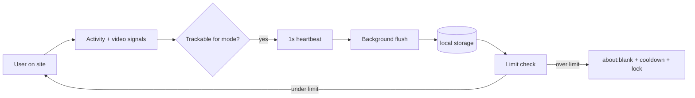

# FocusOverlay

**Hard limits for distracting sites.** Track real active time, set daily and session caps, and get sent to a blank page when time is up — no snooze, no “just five more minutes.”

Built as a Chrome Extension (Manifest V3). All data stays on your device.

> This repo is named **ShortsInsight**; the extension product name is **FocusOverlay**.

---

## Why FocusOverlay?

Most screen-time tools nudge you with soft reminders. FocusOverlay is built for people who want **enforcement**:

- Counts **active** time (idle-aware, video-aware), not just “tab open”
- **Daily** budgets and **session** bursts, per site
- **Stricter caps** on evenings and weekends
- **Cooldown** after a block so you cannot instantly reload
- **Limit lock** — you cannot raise a cap while that limit period is active
- **No bypass** after a block (`about:blank`, no snooze button)

---

## Supported sites

| Site | Tracking modes |
|------|----------------|
| YouTube | Entire site · Shorts only · Video playing only |
| Instagram | Entire site · Reels only · Video playing only |
| X (Twitter) | Entire site · Video playing only |
| TikTok | Entire site · Video playing only |
| Facebook | Entire site · Reels only · Video playing only |
| Reddit | Entire site · Video playing only |
| LinkedIn | Entire site · Video playing only |
| Twitch | Entire site · Video playing only *(default)* |
| Pinterest | Entire site · Video playing only |

Modes are configured per site in the options page.

---

## Features

### Time tracking

- **Active time** — mouse, keyboard, scroll, touch, and visibility; 30s idle threshold
- **Session time** — continuous active time in one visit; resets after 5 minutes idle
- **Video detection** — counts playback when a video is substantially visible (≥20% in viewport)
- **SPA-aware** — detects route changes on single-page apps (History API + polling)
- **Unified engine** — one tracker pipeline for all sites via a platform registry

### Limits

- **Daily limits** — per site, in minutes (`0` = unlimited)
- **Session limits** — max continuous active time before a forced break
- **Scheduled limits** — lower evening and/or weekend caps (strictest applicable cap wins)
- **80% warnings** — toast when you approach a limit (no way to extend time)

### Enforcement

- Tab redirects to **`about:blank`** when daily or session limit is hit
- **Cooldown** (default 15 min) blocks revisiting the site via navigation guard
- Enforcement runs in the **content script** and **background** (not only the overlay UI)

### Settings & data

- **Popup** — quick usage summary and link to full settings
- **Options page** — all limits, modes, schedule, cooldown, export, reset
- **Export CSV** — historical usage by day and platform
- **Reset today** — clear current day stats only
- **Limit lock** — cannot *increase* limits until the period ends (midnight for daily, ~5 min for session)

### Privacy

- No accounts, no cloud, no analytics server
- Data in `chrome.storage.local` only
- System fonts on injected UI (no Google Fonts on third-party pages)

---

## Quick start

### Requirements

- [Node.js](https://nodejs.org/) 18+
- Google Chrome or Chromium-based browser

### Install from source

```bash
git clone https://github.com/YOUR_USERNAME/ShortsInsight.git
cd ShortsInsight
npm install
npm run build
```

Load the extension in Chrome:

1. Open `chrome://extensions`
2. Enable **Developer mode**
3. Click **Load unpacked**
4. Select the `dist/` folder

### Configure

1. Click the extension icon → **Open full settings**
2. Set **daily** and **session** limits (minutes) per site
3. Optional: enable **scheduled limits**, change **tracking mode**, adjust **cooldown**
4. Click **Save settings**
5. Visit a supported site — a small timer appears top-right

---

## How tracking works



1. A **content script** runs on supported domains and classifies the page (Shorts, Reels, feed, etc.).
2. Each second, the **tracking engine** decides if you are *active* for your chosen mode.
3. Active seconds are sent to the **service worker** and flushed to storage every 5 seconds.
4. **Limit guard** compares usage to effective limits (including schedule).
5. At **80%**, a warning toast appears once.
6. At **100%**, the tab goes blank, cooldown starts, and limit increases are locked.

---

## Development

```bash
# Install dependencies
npm install

# Development build with HMR (CRXJS)
npm run dev

# Production build
npm run build

# Preview build output
npm run preview
```

After `npm run dev` or `npm run build`, reload the extension on `chrome://extensions` when you change code.

### Project structure

```
├── manifest.json          # Extension manifest (MV3)
├── index.html             # Browser action popup
├── options.html           # Full settings page
├── docs/
│   └── PDD.md             # Product design document
└── src/
    ├── background/        # Service worker, alarms, navigation guard
    ├── content/           # Content script entry + limit guard
    ├── components/        # Overlay, settings form, toasts
    ├── lib/
    │   ├── platforms/     # Site registry & classifiers
    │   └── tracking/      # Activity, session, media, SPA, engine
    ├── storage/           # chrome.storage wrapper
    ├── popup/             # Popup UI
    └── options/           # Options page UI
```

### Adding a new site

1. Add the platform id to `TRACKED_PLATFORMS` in `src/types.ts`
2. Register hosts and a `classify()` function in `src/lib/platforms/registry.ts`
3. Add URL patterns to `host_permissions` and `content_scripts.matches` in `manifest.json`

See [docs/PDD.md](docs/PDD.md) for full product and architecture detail.

---

## Tech stack

| Layer | Technology |
|-------|------------|
| Extension | Chrome Manifest V3 |
| UI | React 18, TypeScript, Tailwind CSS |
| Build | Vite 5, [@crxjs/vite-plugin](https://crxjs.dev/vite-plugin) |
| Icons | [Lucide](https://lucide.dev/) |
| Storage | `chrome.storage.local` |

---

## Limitations

FocusOverlay is a browser extension, not OS-level parental control. A motivated user can still:

- Disable or uninstall the extension
- Clear extension storage
- Use another browser or device

Daily totals may lag storage by up to ~5 seconds (the overlay still ticks live while you are active). Scheduled limits use your **local timezone**.

---

## Roadmap

- [ ] Firefox MV3 build
- [ ] Configurable warning threshold (default 80%)
- [ ] Optional `chrome.notifications` for limit warnings
- [ ] Encrypted backup export

Ideas and PRs welcome.

---

## Contributing

1. Fork the repository
2. Create a feature branch (`git checkout -b feature/my-change`)
3. Commit your changes (`git commit -m 'Add something useful'`)
4. Push and open a Pull Request

Please keep changes focused and match existing TypeScript/React patterns. Run `npm run build` before submitting.

---

## Documentation

- **[Product Design Document (PDD)](docs/PDD.md)** — requirements, data model, algorithms, test plan

---

## Acknowledgments

Built to help reclaim attention from algorithmic feeds — one enforced limit at a time.

---

<p align="center">
  <sub>If FocusOverlay helps you, consider starring the repo.</sub>
</p>
