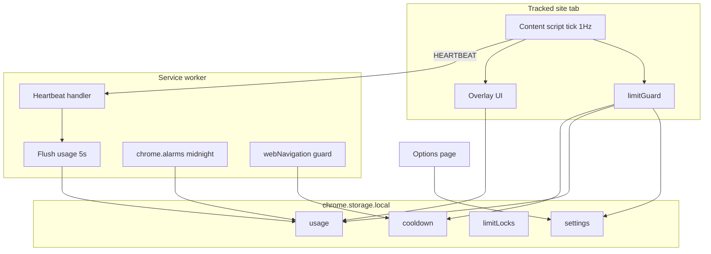

# FeedBlocker — Product Design Document (PDD)

**Version:** 1.1.0  
**Last updated:** 2026-05-24  
**Product name:** FeedBlocker  
**Repository folder:** FeedBlocker  
**Platform:** Chrome Extension (Manifest V3)

---

## 1. Executive summary

FeedBlocker is a browser extension that tracks how long a user actively spends on YouTube, Instagram, and X (Twitter). It enforces user-defined **daily** and **session** time limits, optional **scheduled stricter caps** (evenings/weekends), and a **post-block cooldown** that prevents immediately returning to a site. When a limit is exceeded, the tab is redirected to `about:blank` with **no snooze or override**.

All usage data is stored locally in `chrome.storage.local`. There is no backend, no accounts, and no mock data.

---

## 2. Goals and non-goals

### 2.1 Goals

| ID | Goal |
|----|------|
| G1 | Accurately measure **active** time per platform (idle-aware). |
| G2 | Enforce limits reliably (content script + overlay + background navigation guard). |
| G3 | Prevent users from **raising limits while a limit period is active** (limit lock). |
| G4 | Support **per-site tracking modes** (YouTube Shorts-only, Instagram Reels-only). |
| G5 | Support **scheduled stricter caps** for evenings and weekends. |
| G6 | Warn users at **80%** of applicable limits without allowing bypass. |
| G7 | Provide a full **options page** for configuration, export, and data reset. |
| G8 | Respect privacy: **no Google Fonts** on third-party pages; system font stack only. |

### 2.2 Non-goals (v1.1)

| ID | Non-goal |
|----|----------|
| NG1 | Cloud sync, multi-device accounts, or social features. |
| NG2 | OS-level blocking (users can still disable the extension). |
| NG3 | TikTok support (removed from data model). |
| NG4 | Snooze, “ignore for 5 minutes,” or any bypass after a block. |
| NG5 | Parental / enterprise MDM deployment. |

---

## 3. Target users and use cases

### 3.1 Primary persona

**Focused scroller** — spends unstructured time on Shorts/Reels/X and wants hard guardrails, not soft reminders.

### 3.2 Use cases

1. **Daily budget** — “Max 60 minutes on YouTube per day.”
2. **Session burst control** — “Max 15 continuous minutes before forced break.”
3. **Evening reduction** — “After 6pm, only 20 minutes total on Instagram.”
4. **Weekend reduction** — “On Sat/Sun, cap Twitter at 30 minutes.”
5. **Shorts-only discipline** — “Only count YouTube Shorts, not long videos.”
6. **Reels-only discipline** — “Only count Instagram Reels.”
7. **Audit** — Export CSV of historical usage from options page.

---

## 4. Supported platforms

| Platform | Hosts | Content script | Tracking modes |
|----------|-------|----------------|----------------|
| YouTube | `*.youtube.com` | Yes | `all`, `shorts_only` |
| Instagram | `*.instagram.com` | Yes | `all`, `reels_only` |
| X / Twitter | `*.twitter.com`, `*.x.com` | Yes | `all` only |

**Removed:** TikTok (was in types/UI without a tracker).

---

## 5. Core concepts

### 5.1 Active time

Time counts toward limits only when **active**:

- User input (mouse, keyboard, scroll, click) within the last **30 seconds**, AND tab is **visible**
- **YouTube exception (mode `all`):** playing `<video>` counts as active even if tab is in background

Inactive periods do not send `HEARTBEAT` messages to the background worker.

### 5.2 Session time

Continuous active seconds in the **current tab visit**. Resets after **5 minutes** without activity (`SESSION_IDLE_RESET_MS`).

Session limits apply to session time, not calendar time.

### 5.3 Daily time

Sum of active seconds for a platform on the **local calendar day** (`YYYY-MM-DD` in the user’s local timezone).

Stored in `chrome.storage.local` under `usage[date]`.

### 5.4 Effective daily limit

The **strictest** applicable cap among:

1. Base daily limit (`settings.limits[platform]`)
2. Evening cap (`schedule.eveningLimits`) if schedule enabled and current hour ∈ `[eveningStartHour, eveningEndHour)`
3. Weekend cap (`schedule.weekendLimits`) if schedule enabled and day is Saturday or Sunday

If multiple schedule caps apply, **`min()`** of all applicable caps (in seconds) is used.

`0` on any schedule field means “fall through” to the next rule, not “zero minutes allowed.”

### 5.5 Limit lock

When a user **hits** a limit, they cannot **increase** related settings until the lock expires:

| Lock type | Trigger | Expires | Blocks increases to |
|-----------|---------|---------|---------------------|
| Daily lock | Daily usage ≥ effective daily limit | Next **local midnight** | `limits`, `schedule.eveningLimits`, `schedule.weekendLimits` |
| Session lock | Session ≥ session limit | `now + 5 min` (aligned with idle reset) | `sessionLimits` |

**Decreases** are always allowed (user can make limits stricter).

Locks are stored in `limitLocks` (`daily`, `session` per platform).

### 5.6 Cooldown

After a **daily** or **session** block (not cooldown-only redirects):

- `cooldown.until[platform] = now + cooldownMinutes × 60s` (default **15 min**)
- Background `webNavigation.onCommitted` redirects any navigation to that platform to `about:blank` while cooldown is active
- Content script `limitGuard` also enforces on each tick

### 5.7 Enforcement: blank page

No modal, no snooze. On block:

```text
window.top.location.replace('about:blank')
```

---

## 6. User experience

### 6.1 On-page overlay (content script)

Small fixed widget (top-right, shadow DOM):

- Today’s time (live + storage sync)
- Session time (if session limit configured)
- Effective daily cap label when schedule may apply
- Progress bar (turns amber ≥80%, red at 100%)

### 6.2 Warning toast (80%)

- Shown once per threshold per page load (`warned.daily`, `warned.session`)
- Bottom-center dark toast, 5s fade
- Example: `youtube: ~4 min left on today's limit`
- **No dismiss action** that extends time

### 6.3 Browser action popup

- Today’s usage summary + 7-day chart + per-site breakdown
- Link to **full options page**

### 6.4 Options page (`options.html`, tab)

Sections:

1. Today’s usage (dashboard)
2. Settings form (all limits, modes, schedule, cooldown)
3. Data tools (export CSV, reset today)

### 6.5 Settings save feedback

- Success: green banner
- Lock violation: red banner listing platforms where increases were rejected; saved values revert for locked fields

---

## 7. Functional requirements

### 7.1 Tracking

| ID | Requirement | Priority |
|----|-------------|----------|
| FR-T1 | 1 Hz heartbeat when active and trackable | P0 |
| FR-T2 | Background aggregates heartbeats, flushes to storage every 5s | P0 |
| FR-T3 | YouTube video view count on new `/watch` or `/shorts/` ID | P2 |
| FR-T4 | `trackingMode` filters heartbeats (Shorts/Reels only) | P0 |
| FR-T5 | Settings changes apply without reload (`storage.onChanged`) | P1 |

### 7.2 Limits and enforcement

| ID | Requirement | Priority |
|----|-------------|----------|
| FR-L1 | Evaluate limits every 1s in `limitGuard` (content script) | P0 |
| FR-L2 | Redirect to `about:blank` when blocked | P0 |
| FR-L3 | Set daily/session locks on block | P0 |
| FR-L4 | Start cooldown on daily/session block | P0 |
| FR-L5 | Navigation guard during cooldown | P0 |
| FR-L6 | 80% warning toast | P1 |
| FR-L7 | Reject limit **increases** while locked (`saveSettings`) | P0 |

### 7.3 Schedule

| ID | Requirement | Priority |
|----|-------------|----------|
| FR-S1 | Enable/disable schedule globally | P1 |
| FR-S2 | Configurable evening window (start/end hour 0–23) | P1 |
| FR-S3 | Per-platform evening caps (minutes) | P1 |
| FR-S4 | Per-platform weekend caps (minutes) | P1 |
| FR-S5 | `min()` of applicable caps | P1 |

### 7.4 Data lifecycle

| ID | Requirement | Priority |
|----|-------------|----------|
| FR-D1 | Midnight rollover via `chrome.alarms` + date key check | P0 |
| FR-D2 | Clear daily locks at rollover | P0 |
| FR-D3 | Export all usage rows as CSV | P1 |
| FR-D4 | Reset today’s usage only (confirm dialog) | P1 |

---

## 8. System architecture



### 8.1 Module map

| Path | Responsibility |
|------|----------------|
| `src/lib/limits.ts` | Effective limits, tracking mode filter, host→platform |
| `src/lib/dates.ts` | Local date, midnight, weekend/evening helpers |
| `src/storage/index.ts` | Persistence, locks, cooldown, CSV, rollover |
| `src/content/limitGuard.ts` | Enforcement, warnings, block side-effects |
| `src/content/shared.tsx` | Activity/session trackers, overlay mount |
| `src/content/{youtube,instagram,twitter}/` | Platform-specific tick logic |
| `src/background/index.ts` | Messages, flush, alarm install |
| `src/background/alarms.ts` | Midnight rollover alarm |
| `src/background/navigation.ts` | Cooldown redirect |
| `src/components/Overlay.tsx` | On-page timer UI |
| `src/components/SettingsForm.tsx` | Full settings UI |
| `src/options/OptionsApp.tsx` | Options page shell |
| `src/popup/` | Quick usage popup |

### 8.2 Message protocol

| Type | Direction | Payload | Action |
|------|-----------|---------|--------|
| `HEARTBEAT` | Content → BG | `{ platform, videoType, isActive }` | Queue +1s if active |
| `VIDEO_VIEW` | Content → BG | `{ platform, videoType }` | Increment video count |

---

## 9. Data model

### 9.1 `usage` (object keyed by `YYYY-MM-DD` local)

```typescript
interface DailyUsage {
  date: string;
  total: number;              // seconds, all platforms
  byPlatform: Record<Platform, number>;
  videoCounts: Record<Platform, number>;
}
```

### 9.2 `settings`

```typescript
interface AppSettings {
  limits: Record<Platform, number>;           // seconds, 0 = off
  sessionLimits: Record<Platform, number>;    // seconds, 0 = off
  trackingMode: Record<Platform, TrackingMode>;
  schedule: ScheduleSettings;
  cooldownMinutes: number;                    // default 15
}
```

### 9.3 `limitLocks`

```typescript
interface LimitLocks {
  daily: Partial<Record<Platform, number>>;   // unix ms, midnight
  session: Partial<Record<Platform, number>>; // unix ms
}
```

### 9.4 `cooldown`

```typescript
interface CooldownState {
  until: Partial<Record<Platform, number>>;   // unix ms
}
```

### 9.5 `currentDate`

String `YYYY-MM-DD` for rollover detection when alarms are delayed.

---

## 10. Permissions rationale

| Permission | Why |
|------------|-----|
| `storage` | Usage and settings |
| `alarms` | Midnight rollover |
| `webNavigation` | Cooldown redirect on revisit |
| `tabs` | `chrome.tabs.update` for cooldown redirect |

**Host permissions:** YouTube, Instagram, Twitter/X only.

---

## 11. Tracking mode rules

### YouTube

| Mode | Pages tracked | Heartbeat when |
|------|---------------|----------------|
| `all` | `/watch`, `/shorts/` | Active on those pages OR video playing |
| `shorts_only` | `/shorts/` only | Active on Shorts URLs |

### Instagram

| Mode | Pages tracked |
|------|-----------------|
| `all` | All paths (feed + reels) |
| `reels_only` | Paths containing `/reels/` |

### Twitter / X

Always full-site tracking.

---

## 12. Limit evaluation algorithm

```text
INPUT: platform, settings, dailyUsage, sessionSeconds, cooldownUntil, now

effectiveDaily = getEffectiveDailyLimit(platform, settings, now)
effectiveSession = settings.sessionLimits[platform]

IF cooldownUntil > now → BLOCK (cooldown)
ELSE IF dailyUsage >= effectiveDaily AND effectiveDaily > 0 → BLOCK (daily)
ELSE IF sessionSeconds >= effectiveSession AND effectiveSession > 0 → BLOCK (session)

warnDaily = dailyUsage >= 0.8 * effectiveDaily AND NOT daily blocked
warnSession = sessionSeconds >= 0.8 * effectiveSession AND NOT session blocked
```

On block (daily/session):

1. Set appropriate lock
2. Start cooldown
3. `forceBlankPage()`

---

## 13. Midnight rollover

1. **`chrome.alarms`** `focus-midnight-rollover`: first fire at next local midnight, then every 24h
2. **`rolloverDayIfNeeded()`** on flush, options load, and `getTodayUsage`: compares `currentDate` key to `localDateString()`
3. On rollover: update `currentDate`, **clear daily locks** (session locks expire by timestamp)

---

## 14. CSV export format

```csv
date,total,youtube,instagram,twitter,youtube_videos,instagram_videos,twitter_videos
2026-05-24,3600,1800,900,900,12,0,0
```

Generated from all keys in `usage`.

---

## 15. Security and privacy

| Topic | Approach |
|-------|----------|
| Data location | Local only |
| Fonts | System stack in injected CSS (no CDN on host pages) |
| Bypass | User can disable extension or clear storage — documented limitation |
| Message validation | Heartbeat accepts known platforms only via typed payloads |
| XSS on host page | Overlay in closed shadow DOM |

---

## 16. Known limitations and gaps (honest)

| Gap | Severity | Notes |
|-----|----------|-------|
| Determined user can disable extension | High | By design for consumer extension |
| ~5s storage lag on daily meter | Low | Flush interval; overlay ticks locally when active |
| SPA navigation may remount scripts | Low | Acceptable; session tracker resets in-memory |
| `about:blank` then back button | Medium | Cooldown + limitGuard should re-block |
| Schedule uses local timezone only | Low | Document in settings |
| No Firefox build | Low | Future port |
| Session lock duration fixed at 5 min from block | Low | Matches idle reset; may not match live session end |
| Instagram “all” tracks feed scrolling | Info | By design in `all` mode |

### 16.1 Fixes applied in v1.1

- TikTok removed from schema
- Enforcement duplicated in `limitGuard` (not overlay-only)
- Local dates for rollover and charts
- Limit lock on increase while blocked
- No snooze / no Google Fonts

---

## 17. Future roadmap (suggested)

| Phase | Feature |
|-------|---------|
| v1.2 | `declarativeNetRequest` optional hard block during cooldown |
| v1.2 | Per-limit warning threshold setting (default 80%) |
| v1.3 | Weekly email-style summary (local notification via `chrome.notifications`) |
| v1.4 | Firefox MV3 build |
| v2.0 | Optional encrypted backup file export |

---

## 18. Test plan

### 18.1 Manual — tracking

- [ ] YouTube `all`: time increases on `/watch` and `/shorts/`
- [ ] YouTube `shorts_only`: no time on `/watch`, time on `/shorts/`
- [ ] Instagram `reels_only`: no time on feed, time on `/reels/`
- [ ] Idle 30s: heartbeats stop
- [ ] Session resets after 5 min idle

### 18.2 Manual — limits

- [ ] Daily limit → blank page + daily lock + cooldown
- [ ] Cannot raise daily limit until midnight (decrease works)
- [ ] Session limit → blank page + session lock
- [ ] 80% toast appears once
- [ ] Revisit during cooldown → blank page from navigation guard

### 18.3 Manual — schedule

- [ ] Evening cap applies in configured hours
- [ ] Weekend cap applies Sat/Sun
- [ ] Lower of evening/weekend used when both apply

### 18.4 Manual — data

- [ ] CSV export downloads valid file
- [ ] Reset today clears only current date
- [ ] Midnight alarm clears daily locks (or simulate via date key)

### 18.5 Build

- [ ] `npm run build` succeeds
- [ ] Load `dist/` unpacked in Chrome

---

## 19. Build and release

```bash
npm install
npm run build
# Chrome → chrome://extensions → Load unpacked → dist/
```

**Versioning:** Manifest `version` field; bump on functional releases.

---

## 20. Glossary

| Term | Definition |
|------|------------|
| Active | User engaged per idle/visibility rules |
| Session | Continuous active period in one tab visit |
| Effective limit | Min of applicable daily caps after schedule |
| Limit lock | Temporary ban on increasing limits |
| Cooldown | Post-block revisit prevention window |
| Heartbeat | 1-second active ping to background |

---

## 21. Document history

| Version | Date | Changes |
|---------|------|---------|
| 1.0 | 2026-05-24 | Initial MVP PDD (implicit) |
| 1.1 | 2026-05-24 | Full PDD: schedule, modes, locks, cooldown, options, alarms, no snooze |

---

*End of document*
